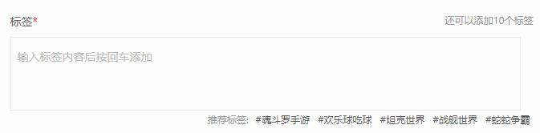

# 标签组件

最近在改版的时候，遇到一个标签插入的小需求，没错，就像下图显示的那样：



刚开始想着不就一个简单的标签组件，很简单的嘛，可是后来发现越简单的东西，可能需要考虑的用户体验，还有本身组件的可扩展性都是需要仔细斟酌的。

在踩了坑之后，决定把这个标签逻辑重构，形成单独的标签组件，以方便日后的复用

## 标签组件功能

在决定做成组件之前，又重新看了之前的代码，然后思考了一下一个标签组件到底需要什么功能，才能保证这个组件的可扩展性高，用户体验又好呢，于是就规划了一下这个组件可以有的功能点：

1. 标签插入去重
2. 可设定空格或回车输入
3. 限制可插入标签数
4. 是否有需屏蔽标签
5. 是否有推荐标签
6. 删除标签方法（回退、点击删除）
7. 各种提示的自定义

## 标签组件基本架构

```javascript
(function (window) {
        var TagSdk = function () {
            return;
        };
        /**
         * @description 扩展参数对比
         * @param {object} target - 目标对象
         * @param {object} source - 源对象
         * @returns {object} - 合成的对象
         */
        TagSdk.prototype.extend = function (target, source) {
              for (var p in source) {
                  if (source.hasOwnProperty(p)) {
                      target[p] = source[p];
                  }
              }
              return target;
          };
        TagSdk.prototype.xxx = function() {
          
        };
})(window, document);
```

## 组件说明

- 开始使用，默认参数如下

```javascript
    /**
     * 初始化
     * @param opts 参数
     * @param {number} insertType - 输入标签的方式，13为回车，32为空格，如果选择32，则输入的标签不能允许有空格
     * @param {number} maxTag - 允许插入的标签数量
     * @param {number} maxTagLength - 标签字数限制
     * @param {string} maxTagTip - 可插入标签数量提示容器
     * @param {string} alertTag - 标签相关提示容器，如果为alert，则直接弹出系统提示框
     * @param {string} hotTag - 推荐标签
     * @param {string} inputTag - 输入标签为空的提示
     * @param {string} lengthError - 超过限制标签数量提示
     * @param {string} exitError - 标签去重提示
     * @param {bollean} emptyFlag - 是否必须填标签
     */
    TagSdk.tagInit({
            insertType:13,
            maxTag:20,
            maxTagLength:20,
            maxTagTip:'tag-num',
            alertTag:'tag-alert',
            hotTag:'tag-hot',
            inputTag:'tag-input',
            inputError:'请输入标签',
            numError:'已超过限制标签数',
            exitError:'已存在标签',
            emptyFlag:false
    });
```

   - 删除功能
   
   按回退键，或直接点击标签进行删除